# Vibe Shop

> **Phần mềm bán hàng & quản lý cho cửa hàng nhỏ — nhẹ, mượt, miễn phí, không ràng buộc.**

📥 **Tải về**: <https://github.com/learningmapn/free-apps/tree/main/downloads/vibe-shop>

---

## 📸 Giao diện

| | |
|:---:|:---:|
| 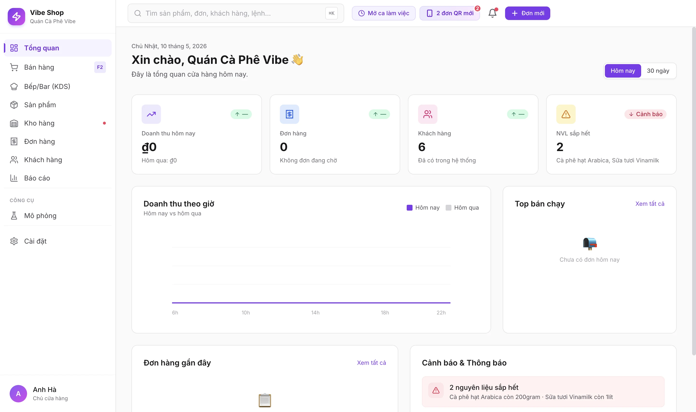 | 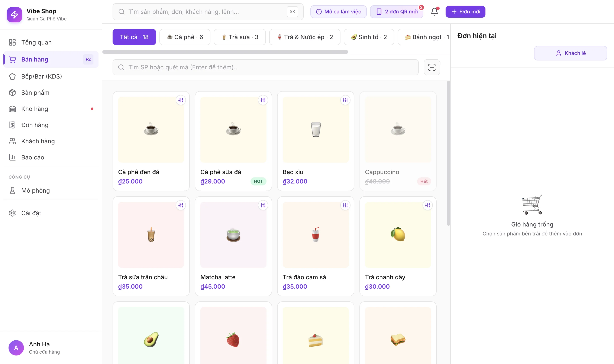 |
| **Dashboard** — Tổng quan doanh thu | **POS** — Bán hàng tại quầy |
| 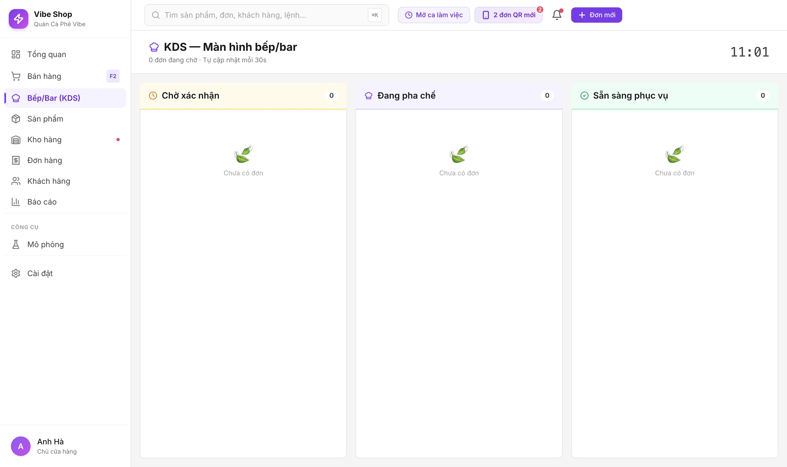 | 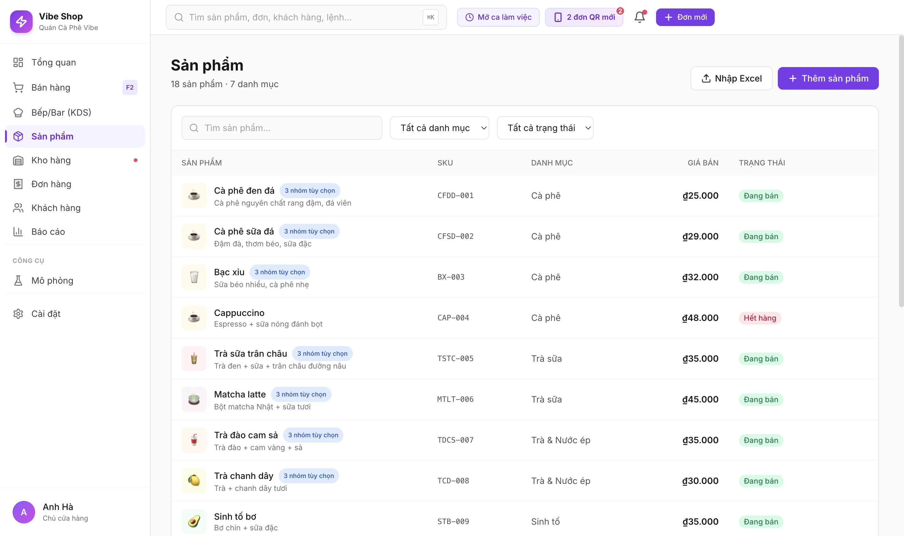 |
| **KDS** — Bếp/Bar Kanban | **Sản phẩm** — Quản lý menu |
| 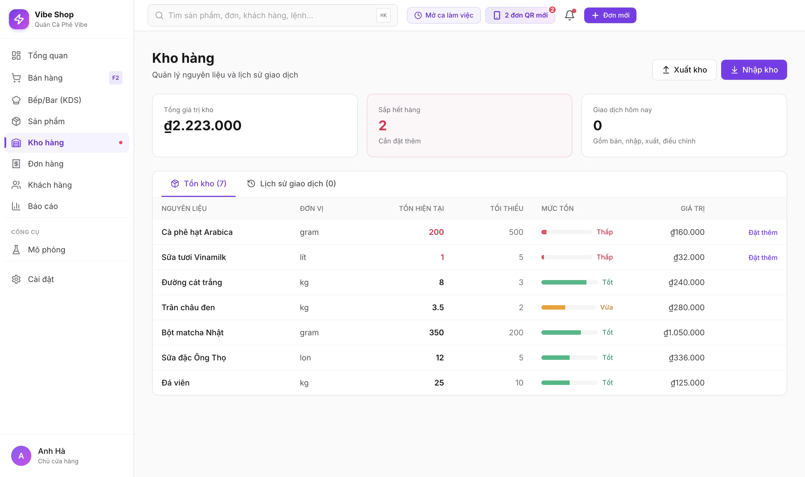 | 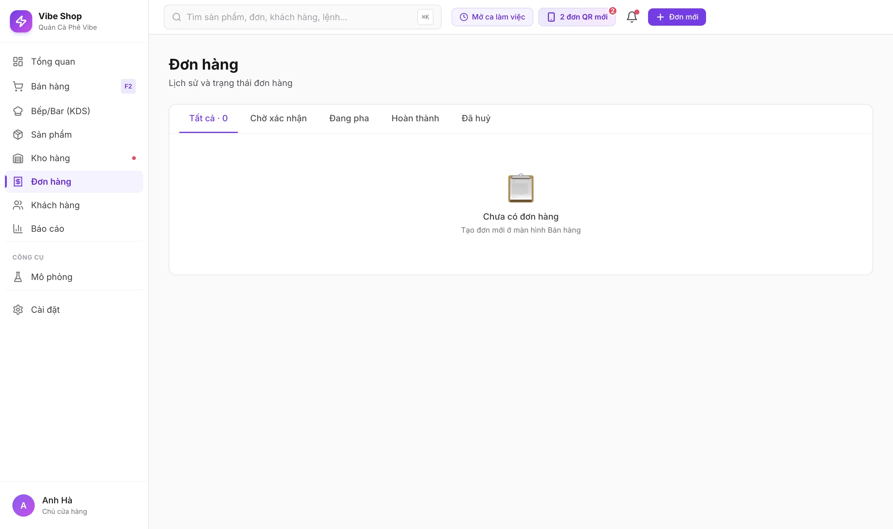 |
| **Kho hàng** — Trừ kho theo công thức | **Đơn hàng** — Lịch sử & chi tiết |
| 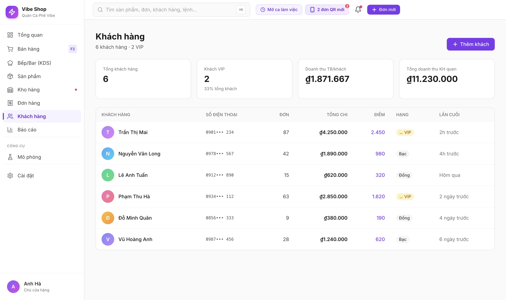 | 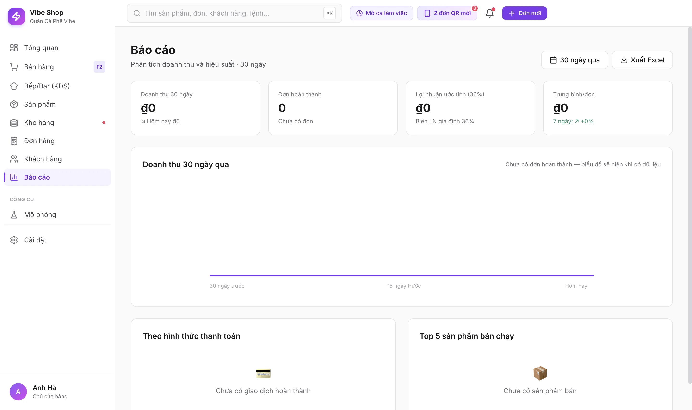 |
| **Khách hàng** — Loyalty Vàng/Bạc/Đồng | **Báo cáo** — Doanh thu 30 ngày |
| 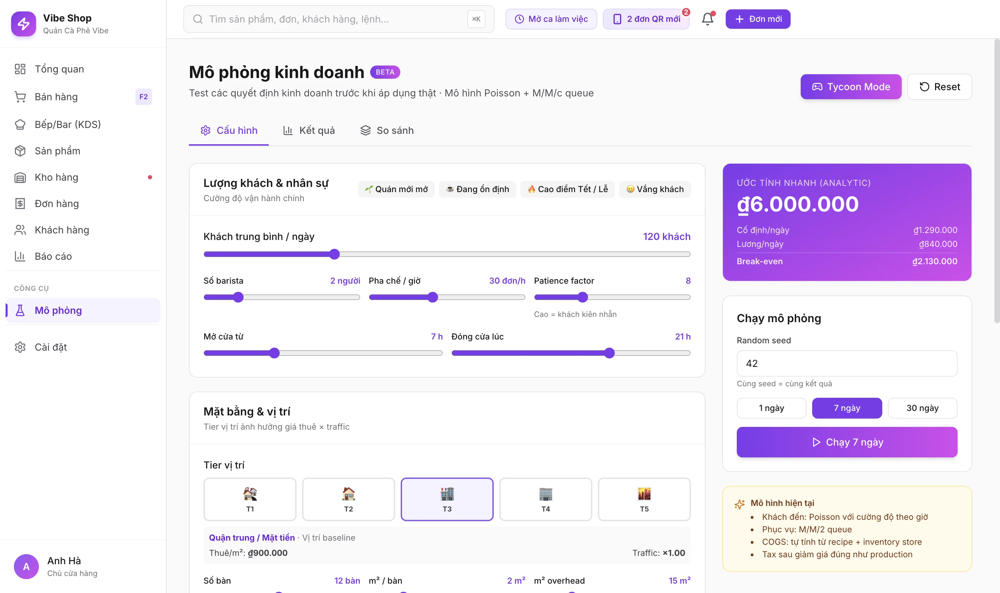 | 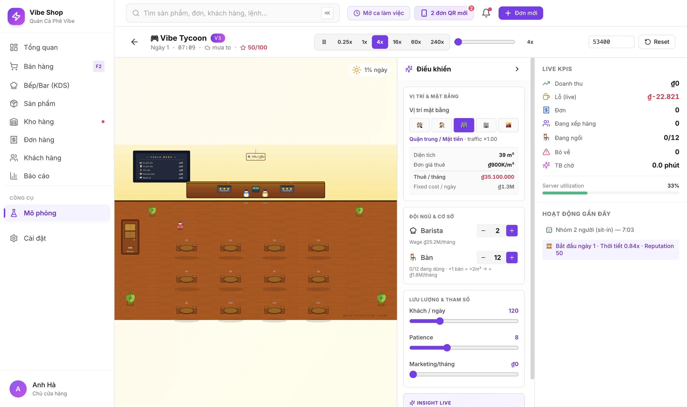 |
| **Mô phỏng** — Thử nghiệm 30 ngày | **Tycoon** — Quản lý quán bằng game |
| 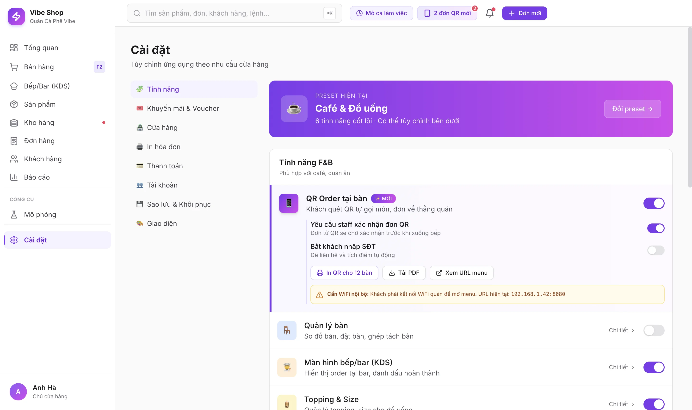 | 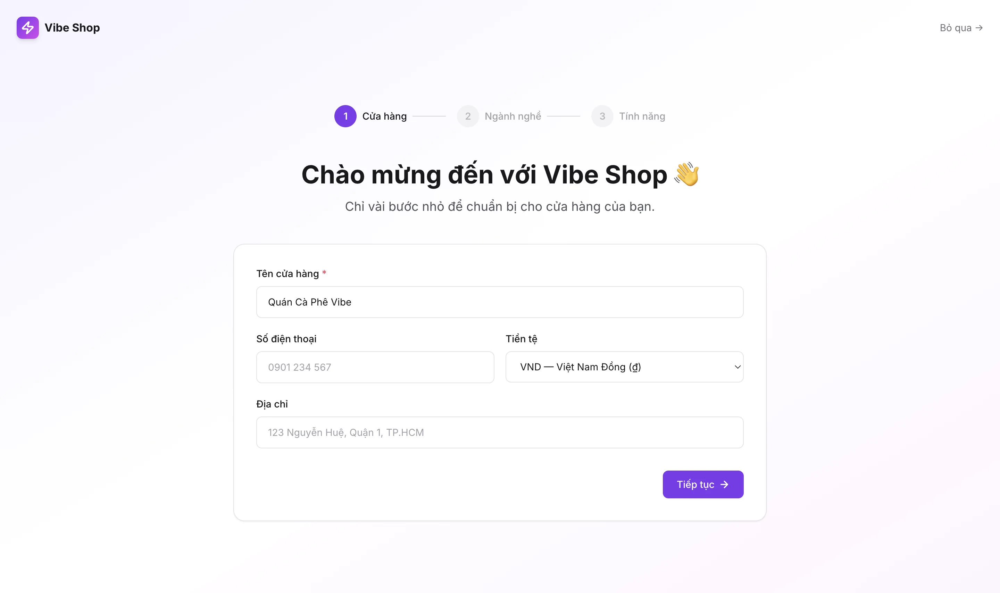 |
| **Cài đặt** — 14 tính năng bật/tắt | **Onboarding** — Setup 3 bước |
| 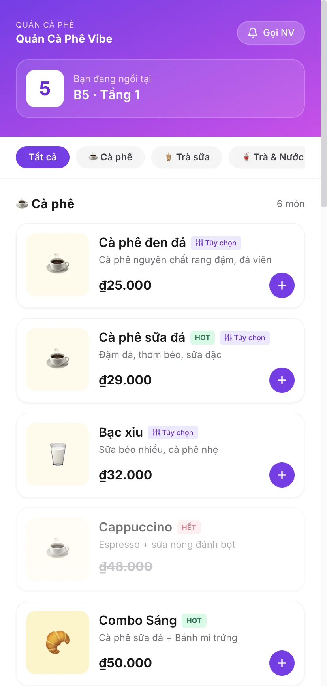 | |
| **QR khách** — Tự gọi món qua điện thoại | |

---

## 💡 Câu chuyện đằng sau

Mỗi cửa hàng nhỏ ở Việt Nam — từ quán cafe góc phố tới tiệm tạp hoá đầu hẻm — đều cần một thứ rất đơn giản: một công cụ giúp bán hàng, quản lý kho, theo dõi khách quen, in hoá đơn và biết được hôm nay lãi lỗ ra sao. Vậy thôi.

Nhưng tìm phần mềm cho việc này lại không đơn giản:

- Phần mềm "miễn phí" thường giới hạn 100 đơn/tháng, ép nâng cấp.
- Phần mềm trả phí thì 200-800K/tháng, đủ ăn vài bát phở mỗi ngày.
- Phần mềm "cloud" bắt phụ thuộc internet — mất mạng là mất bán hàng.
- Phần mềm "đầy đủ tính năng" nặng tới 200MB, máy yếu chạy lag.
- Học cách dùng tốn cả tuần, nhân viên mới khó vào.

**Vibe Shop ra đời để khác đi.**

Một bộ phần mềm gọn nhẹ — toàn bộ chỉ **4.2 MB** — chạy mượt trên cả máy 5 năm tuổi. Dữ liệu lưu **ngay trên máy của bạn**, không cần internet, không phụ thuộc server ai. Mở ra là dùng được. Không tài khoản, không subscription, không "thử miễn phí 7 ngày".

Miễn phí. Mãi mãi.

---

## 🎯 Vibe Shop làm được gì

### 🛒 Bán hàng tại quầy (POS)
Bán nhanh chỉ trong vài giây: tìm món, chọn size + topping (nếu là F&B), áp voucher, in hoá đơn k80, thanh toán Tiền mặt / QR / Thẻ. Hỗ trợ barcode/SKU quét nhanh, command palette ⌘K tìm mọi thứ.

### 📱 Khách tự gọi qua QR tại bàn
Khách quét QR trên điện thoại → menu mobile-first hiện ra → chọn món → submit. Đơn về thẳng KDS với dấu **🔔 QR**. Bạn không cần app riêng cho khách, không cần đăng ký gì — link là phần của ứng dụng bạn đã cài.

### 👨‍🍳 Bếp/Bar (KDS) Kanban
Đơn từ POS và QR đổ về thành 3 cột: **Chờ → Đang pha → Sẵn sàng**. Cảnh báo amber khi đơn quá 10 phút, đỏ khi quá 20 phút. Nhân viên bếp không cần dùng giấy hay micro nữa.

### 📦 Quản lý kho thông minh
Recipe-based: bạn khai báo "1 ly cà phê sữa = 15g cà phê + 50ml sữa + 1 thìa đường" — mỗi đơn bán, kho tự động trừ. Cảnh báo NVL sắp hết, lịch sử giao dịch (nhập/xuất/bán/điều chỉnh) đầy đủ.

### 👥 Khách hàng & loyalty
Phân tier Vàng / Bạc / Đồng theo tổng chi tiêu. Hồ sơ chi tiết, lịch sử đơn, ngày ghé gần nhất. Auto-promotion Happy Hour 14-16h, ưu đãi cho khách quen.

### 🍱 Đa ngành
4 preset cấu hình sẵn cho **Café · Quán ăn · Thời trang · Tạp hoá**. 14 tính năng có thể bật/tắt độc lập (POS, KDS, QR, Tables, Variants, Combo, Voucher, Loyalty...). Setup chỉ 3 bước, mất 2 phút.

### 📊 Báo cáo từ data thật
30 ngày doanh thu, top sản phẩm, phân chia phương thức thanh toán, chart đẹp, xuất CSV (Excel mở được).

### 💰 Quản lý ca làm việc
Mở ca với tiền mặt đầu ca → bán cả ngày → đóng ca, đếm tiền thực tế, hệ thống so với dự kiến → hiện chênh lệch. Đơn giản nhưng chống thất thoát.

### 💾 Sao lưu & khôi phục
Một click export toàn bộ data ra file JSON. Đem qua máy mới → import → reload → tất cả về như cũ. Không lo hỏng máy mất hết.

---

## 🎮 Hai thứ độc đáo (chưa app nào có)

### 🧪 Chế độ Mô phỏng — "Thử nghiệm trước khi quyết định"

Bạn đang phân vân:
- *"Nếu tăng giá 10% thì lãi lỗ ra sao?"*
- *"Mở thêm bàn có đáng không?"*
- *"Thuê thêm 1 barista có hoà vốn nhanh hơn?"*
- *"Mặt bằng ở Q1 đắt gấp 4 lần Q.7 — có đáng đông khách hơn?"*

Mô phỏng chạy 30 ngày bằng mô hình Poisson + M/M/c queue + reputation mean-reversion + 5 tier mặt bằng — ra ngay câu trả lời với P&L chi tiết, hourly utilization, lost revenue do queue dài. **Không cần thử thật để biết kết quả.**

### 🎯 Chế độ Tycoon — "Quản lý quán bằng game"

Cartoon 2D shop floor: khách đi vào, xếp hàng, gọi đồ, ngồi bàn, ra về — tất cả real-time với 3 customer archetype (qua đường / khách thường / WFC) hành vi khác nhau. Player điều khiển: thuê/sa thải barista, thêm/bớt bàn, đổi giá, đổi vị trí, bật marketing — xem ngay tác động lên doanh thu và reputation.

Tốc độ 0.25× → 240×, 1 ngày sim trong 3.5 giây thực. Vừa giải trí, vừa học cách cân đối chi phí — vận hành.

> *Đây là mô hình toán học khoa học (Poisson process, compound distributions, AR(1) weather, customer heterogeneity) — không phải đồ chơi. Cùng engine với Mô phỏng nhưng có giao diện trực quan hơn.*

---

## 📥 Tải về & Cài đặt

### 👉 Download tại GitHub

**<https://github.com/learningmapn/free-apps/tree/main/downloads/vibe-shop>**

| Hệ điều hành | File | Cách cài |
|---|---|---|
| 🍎 **macOS** Apple Silicon (M1/M2/M3) | `Vibe-Shop-1.2.0-aarch64.dmg` (~4.2 MB) | Double-click DMG → kéo vào Applications |
| 🍎 **macOS** Intel | (Sắp có qua GitHub Actions) | Tương tự |
| 🪟 **Windows 10/11** x64 | `Vibe Shop Setup 1.2.0.exe` (~83 MB) | Double-click `.exe` → bấm **Next** → **Install** |
| 🐧 **Linux** | (Sắp có qua GitHub Actions) | `.AppImage` chạy thẳng |

> **macOS lần đầu mở**: Gatekeeper sẽ chặn vì app chưa ký Apple Developer ID (không phải malware — chỉ là ký mất 99 USD/năm cho người làm app miễn phí). Vào **System Settings → Privacy & Security** → bấm **Open Anyway**. Lần sau mở thẳng.

> **Windows lần đầu mở**: SmartScreen sẽ cảnh báo. Bấm **More info** → **Run anyway**.

### Cấu hình tối thiểu
- macOS 12+ / Windows 10+ / Ubuntu 20+
- 4 GB RAM, 50 MB ổ cứng
- WebView2 (Win 10) hoặc WebKit (Linux) — Win 11 và macOS đã có sẵn

---

## 🚀 Bắt đầu trong 60 giây

1. **Mở app lần đầu** → hiện onboarding 3 bước:
   - Nhập tên cửa hàng (có thể đổi sau)
   - Chọn ngành: Café / Quán ăn / Thời trang / Tạp hoá
   - Tích chọn tính năng cần dùng
2. **Vào Dashboard** — tổng quan doanh thu hôm nay
3. **Bấm "Đơn mới"** → POS hiện ra → chọn món → thanh toán
4. **Done.** Đã có đơn đầu tiên 🎉

Sau đó tuỳ ý:
- **Sản phẩm** → thêm/sửa món bằng UI có emoji + colour picker
- **Kho hàng** → khai báo NVL + công thức
- **Cài đặt** → bật QR ordering, in QR cho 12 bàn, sao lưu JSON

---

## 👥 Vibe Shop dành cho ai?

✅ **Chủ quán cafe / trà sữa / nước ép** — full POS + KDS + topping/size customizer
✅ **Chủ quán ăn / nhà hàng nhỏ** — sơ đồ bàn, QR menu, recipe deduct
✅ **Shop thời trang / phụ kiện** — variants (size/màu) + barcode/SKU
✅ **Tiệm tạp hoá** — quick scan, không cần combo phức tạp
✅ **Người sắp mở quán** — dùng Mô phỏng để tính trước có lãi không
✅ **Học sinh / sinh viên ngành quản trị, kinh tế** — Tycoon Mode dạy queueing + chi phí cố định/biến đổi qua game

❌ **Chuỗi 10+ chi nhánh** — Vibe Shop hiện local-first, không sync cross-shop (sẽ có ở v2.x)
❌ **Cần tích hợp ERP/POS bên thứ 3** — Vibe Shop độc lập, chưa có API
❌ **Doanh nghiệp có yêu cầu báo cáo thuế phức tạp** — báo cáo cơ bản đủ chuẩn shop nhỏ, không thay thế phần mềm kế toán

---

## 🔧 Tại sao chọn Vibe Shop

| | Vibe Shop | Phần mềm cloud truyền thống |
|---|---|---|
| **Giá** | Miễn phí mãi mãi | 200-800K/tháng |
| **Internet** | Không cần | Bắt buộc |
| **Tốc độ** | Mở < 1 giây | 3-10 giây load |
| **Dung lượng** | 4 MB | 50-300 MB |
| **Data ownership** | Của bạn, trên máy bạn | Server công ty khác |
| **Nâng cấp** | Tải bản mới khi muốn | Auto-update, có khi mất tính năng |
| **Đào tạo** | 5 phút onboarding | Nhân viên cần 1-2 ngày |
| **Mô phỏng kinh doanh** | ✅ Có | ❌ Không |

---

## 🛣️ Đang phát triển

### Sắp ra (v1.3)
- Hỗ trợ thêm Loyalty tier discount tự động
- Date picker khoảng thời gian báo cáo
- UI thêm/sửa khách hàng thủ công
- Excel import/export bulk

### Tương lai (v2.x)
- SQLite thật (hiện dùng localStorage)
- Đồng bộ multi-device qua LAN
- Multi-account / phân quyền nhân viên
- Reservation system (đặt bàn trước)
- Kết nối máy in nhiệt USB (k58/k80)

---

## 💬 Câu hỏi thường gặp

**Q: Có thật là miễn phí mãi mãi không?**
A: Có. Source code open-source, không có ad, không thu phí. Nhà phát triển làm vì muốn giúp các quán nhỏ.

**Q: Data lưu ở đâu? Có an toàn không?**
A: Lưu trong `~/Library/Application Support/com.vibeshop.app/` (Mac) hoặc `%APPDATA%\com.vibeshop.app\` (Win). Không gửi đi đâu. **Hãy backup định kỳ** qua nút Sao lưu trong Cài đặt.

**Q: Mất máy thì sao?**
A: Nếu có file backup JSON → cài app trên máy mới → import → khôi phục đầy đủ. Nếu không có backup → mất sạch (giống như mọi phần mềm local).

**Q: Có app điện thoại không?**
A: Hiện chỉ có desktop. Khách quét QR đặt món thì dùng được trên phone. App điện thoại cho chủ quán đang trong roadmap.

**Q: Hỗ trợ máy in nhiệt không?**
A: Hiện in qua trình duyệt mặc định của hệ điều hành (CSS @media print đã chuẩn k80). Driver USB native sẽ có ở v2.x.

**Q: Tôi không rành tech, có dùng được không?**
A: Được. Onboarding 3 bước, UI đậm chất Vietnam (màu sắc, emoji, từ ngữ thân quen). Nếu kẹt — file [`INSTALL.md`](INSTALL.md) ghi chi tiết cách xử lý mọi vấn đề thường gặp.

**Q: Có thể yêu cầu thêm tính năng không?**
A: Mở issue trên GitHub. Repo source code đầy đủ, ai biết code có thể đóng góp pull request. Người không code có thể đề xuất feature.

---

## 📜 License

Source code: open-source (TBD chính xác — MIT/Apache khả năng cao).
Build sẵn: free for personal & commercial use, không kèm warranty.

---

## 🌟 Ủng hộ chúng tôi

Ủng hộ chúng tôi và học thêm kiến thức tại: **<https://learningmap.net>**

---

## 🙏 Cảm ơn

Cảm ơn bạn đã cân nhắc Vibe Shop cho cửa hàng của mình. Mong rằng app này giúp bạn tiết kiệm được thời gian, giảm stress mỗi ngày bán hàng, và có thêm vài khoảnh khắc rảnh tay uống ly cafe trong chính quán mình.

**Chúc bạn buôn may bán đắt 🎉**

---

📥 **Tải lại**: <https://github.com/learningmapn/free-apps/tree/main/downloads/vibe-shop>
